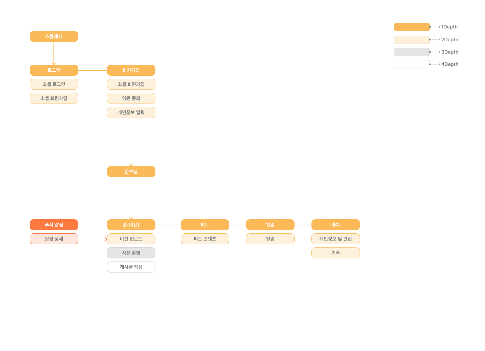
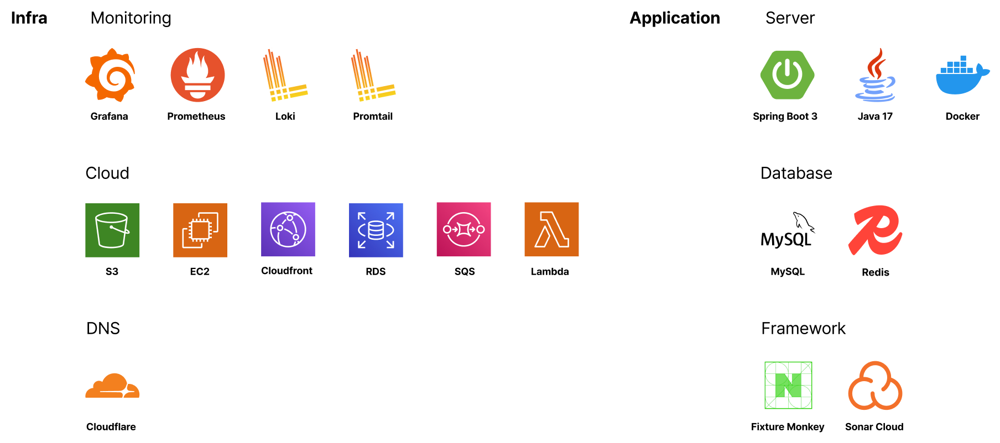
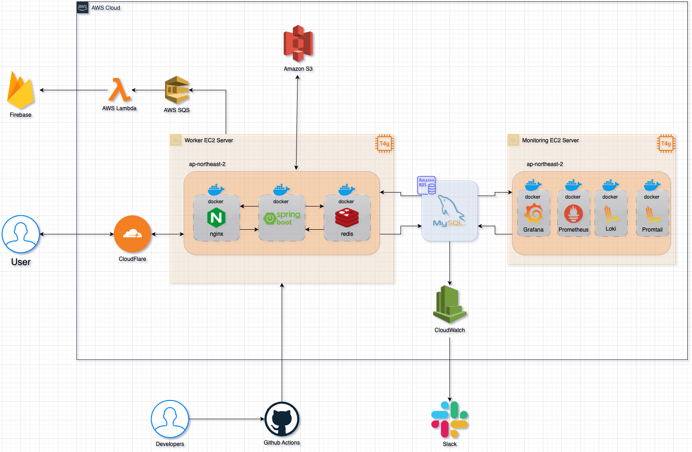

<div align=center>


## 세상 모든 반려동물을 한 자리에서! 왈왈🐶

<b>반려동물과 일상의 추억을 기억하고 싶으신적 없으신가요? <br/>
왈왈은 반려동물과 함께할 수 있는 소소한 미션을 통해 추억을 기록하고, 다른 반려동물의 일상을 발견할 수 있는
펫 커뮤니티 서비스입니다 </b>


</div>

## ✨ IA(Information Architecture)


## 📌 Package Architecture
왈왈 서버 패키지 아키텍처는 레이어드 아키텍처로 구성하였습니다. <br/> 
위 소개한 IA에서 큰 규모의 기능이 정의되지 않아, 당장은 클린 아키텍처 또는 헥사고날 아키텍처의 도입이 필요하지 않다고 판단하였습니다. 
<br/>

```
// 프로젝트 전체 구조
├── src.main.java.com.depromeet.stonebed
│   ├── domain
│   ├── global
│   ├── infra

// domain 패키지는 비즈니스 로직을 담당하며 레이어드 아키텍처 구성
│   ├── domain
│   └── auth
│   └── common
│   └── fcm
│   └── feed
│   └── follow
│   └── image
│   └── member
│   └── mission
│   └── missionHistory
│   └── missionRecordBoost
│   └── sqs

// global 패키지는 전역 설정 담당
│   ├── global
│   └── annotation
│   └── config
│   └── common
│   └── error
│   └── filter
│   └── interceptor
│   └── security
│   └── util

// infra는 외부 연동 및 클라우드 구성 담당
│   ├── infra
│   └── config
│   └── properties
// ...
```

## 💻 Tech Stack


## 🏛️ System Architecture


### 📦 CI/CD
- Github Actions
- Docker Hub
- Docker compose

## 🖥️ Monitoring
모니터링은 Prometheus를 사용하여 서버의 상태에 대한 메트릭 수집과, Grafana를 사용하여 모니터링 대시보드를 구성하였습니다. <br/>
또한, MySQL에 대한 SlowQuery 발생 시 Slack Webhook을 통한 알림 전송을 Lambda 함수로 작성하여 구성하였습니다.<br/>
Loki, Promtail을 사용하여 로그 수집 및 저장을 구성하였습니다.

<h2> 🧑‍💻 Server Developer </h2>
<div align=center>

|                                                                             차윤범                                                                              |                                                               노관옥                                                               |                                                                              박윤찬                                                                              |
|:------------------------------------------------------------------------------------------------------------------------------------------------------------:|:-------------------------------------------------------------------------------------------------------------------------------:|:-------------------------------------------------------------------------------------------------------------------------------------------------------------:|
| <a href="https://github.com/char-yb">  </a> | <a href="https://github.com/kwanok">  </a> | <a href="https://github.com/dbscks97">  </a> |
|                                                                     **Server** (Leader)                                                                      | **Server** |                                                                          **Server**                                                                           |

</div>


